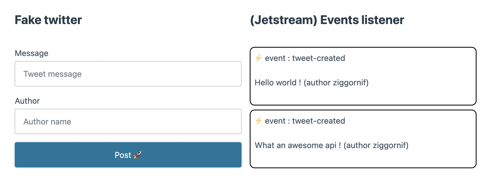

# Go events streaming example with JetStream

## Install

```sh
go install
```

## Run

```sh
go run main.go
```

## Deploy dependencies

```sh
docker compose up -d
```

## How to use it ?

Open http://localhost:8080/ URL in your browser.

Then fill the fake tweet form to post a tweet.

Once the entity is created, an event will be sent in Jetstream then retrieved by the event listener and displayed in the right part of the page.

